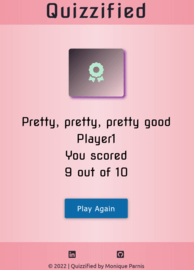

# Quizzified Online Quiz

Welcome to Quizzified! Quizzified is an online quiz game which tests the general knowledge of players young and old.  The set of questions are randomly generated to give returning players a slightly different experience. Each question is presented with four choice answers out of which only one answer is correct. Players are presented with their score after answering all questions, however it is not specified which answers they get right or wrong.  Instead they are encouraged to take the quiz again to better their score.   


[Visit the Quizzified online quiz here](https://monipar.github.io/quiz/)

___

# Table of Contents

1. [Overview](#overview)
2. [Features](#features)  
    * [Index / Home Page](#index--home-page)
    * [Quiz Page](#quiz-page)
    * [Score Display](#score-display)
    * [Future Features](#future-features)
3. [User Experience (UX)](#user-experience-ux)
    * [Strategy / Site Goals](#strategy--site-goals)
    * [Scope / User Stories](#scope--user-stories)
    * [Structure / Design Choices](#structure--design-choices)
    * [Skeleton / Wireframes](#skeleton--wireframes)
    * [Surface](#surface)
4. [Technologies](#technologies)
5. [Testing](#testing)
    * [Validator Testing](#validator-testing)
    * [Lighthouse Testing](#lighthouse-testing)
    * [Manual Testing](#manual-testing)
6. [Bugs](#bugs)
7. [Citation of Sources](#citation-of-sources)
    * [Content](#content)
    * [Media](#media)
8. [Acknowledgements](#acknowledgements)

---

# Overview

The aim of this project is to demonstrate skills in HTML, CSS and JavaScript.  

It is a mobile-first build and is responsive on tablet and desktop. Quizzified is compatible with Chrome, Firefox, Edge and Safari.

The quiz consists of ten questions, with four answer options, of which only one is correct.  It is interactive and accessible by keyboard navigation and screen readers.   

---

# Features

## Existing Features

### Index / Home Page

    iPhone 6/7/8


    Laptop 1024px wide
 

The Home Page consists of the following features:

* A Header

The Header, which displays the name of the quiz, is present on all pages.  It is a link by which the user can navigate back to the Home Page at any moment of the game and restart the quiz.  It is keyboard focusable and has a tooltip when hovered on to show the user that it is a link which will bring them back to start.


* The Logo

The Logo is displayed on the main area of the Home Page as an image.  It consists of a glitched out letter 'Q', the name 'Quizzified' and the slogan 'Stimulate your mind'.  These three components are colourful and produce a good contrast against the dark background of the image.  It is meant to be eye-catching and playful, and gives the quiz a distinguished look.   

* Text and Username input

The main area also features a question to entice the user while also specifying that they are going to be tested on General Knowledge questions.

A text input field invites the user to enter a username in order to start the game.  An error message is displayed under the input field if the user tries to start the game without inserting a valid username. If the username is valid, the user can press the 'Enter' key on their keyboard or navigate to the button below to start the quiz.


* A Start Button

The Start Button is an important feature on the Home Page.  It is large and provides optimal contrast against the light coloured background.  It scales up and changes colour when it is hovered or focussed on. 

* A Footer

The Footer is located at the bottom of all pages of the site.  It provides links to relevant developer pages, displayed as social icons.  They change colour when hovered or focussed on, open in a new tab and contain descriptive labels for screen readers.  Copyright and developer information are also displayed in the Footer.  

## Quiz Page

    Galaxy S8 360px wide


    iPad 768px wide


    laptop 1024px wide


The Quiz Page displays the Header and Footer.  The Main area consists of the following features:

* A question counter and a progress bar

These are displayed at the top of the quiz container.  The question counter counts the questions out of 10.  This is useful for the player to know which question they are on and how many are left.

The Progress Bar is a graphic representation of the above.  A percentage of the capsule shaped bar fills up when the user clicks on the next button and empties when the previous button is clicked. 


* A question and a block of answer options

Each quiz question is displayed one at a time and a set of options are presented below for the player to pick an answer.  Each answer option consists of a radio buttons with a label, styled to look like buttons.  The player can click on the word or on the stylish radio button and it will produce the same effect.  These buttons have a focus and hover effect.  When clicked or selected each button changes colour while the radio button has a slight animation to show that it is being checked.  A keyboard user can easily navigate through the  answer options with the 'arrow keys' and make their selection with the 'space' or 'enter' key.  They can then continue tabbing to the navigation buttons.


* Navigation and Results Buttons

These are displayed at the bottom of the quiz container.  The Next button displayed on the right appears with the first question, while the previous button becomes visible on the left when the user navigates to the second question.  The Results button appears when the user gets to the last question of the quiz.  These buttons all have a hover and focus effect.  When a keyboard user clicks on the next or previous button and is directed to the next or previous question, the focus is brought back to the top.  This is helpful for the user as they don't have to navigate their way back to the answer options using the 'tab' and 'shift' keys.  It also makes the tabbing order more intuitive as one always expects the first tab to bring focus on the top when on a new question. 


An extra feature added here is useful for the player in making sure that they have selected an option answer for every question.  If the player has not selected an answer option for one or more of the questions, an error message is displayed when they click on the 'Results' button.  They can then navigate back and check that their answers. This feature uses their username to attract their attention and give them a more personalised experience.

## Score Display

    Tablet 810px wide


The Score display consists of an icon, a small remark which includes the player's username, the total score and the 'Play Again' button.

At present there are three different outcomes, where the icon and the remark change according to the total score. 

The icon is a visual representation of the score outcome.  The remark is meant to reward, incentivise or gently put down the player while also encouraging them to take the quiz again to improve their outcome.  The 'Play Again' button draws the user's eye and entices them to play the quiz again. Pressing this button will refresh the quiz and bring the player back to the start of the quiz without having to re-insert the Username.

## Future Features

The following features will be added at a later date to improve user experience: 

* More available questions, perhaps using an external API, so that the players are tested on a few different questions every time they take the quiz.
A difficulty level option might be included here.

* Increase the number of different outcomes on 'Score Display' when there are more questions added.

* Store players' data (username, score and date played), using Google Sheets API.  This will make the quiz more competitive as players will return to try beat the top score.

* Give the player an option to share their score via social media. This will entice other players to play the quiz.  

[Back to Top](#table-of-contents)

---

# User Experience (UX)

## Strategy / Site Goals

The online quiz was primarily intended to test a group of thirteen to fifteen year old students, on the various subjects they are studying in school.  Its purpose is to encourage these students to research the questions they are unsure about and keep taking the quiz until they get a perfect score. Teachers, staff members and family members also took the challenge and found that it also helped them to learn a few more historical, scientific, mathematical and popular culture facts they didn't know. 

The main goal of the online quiz game is to provide users with a set of questions that test their knowledge about various subjects.  The questions are of different difficulty levels so that players young and old are able to participate in the quiz. The site is accessible and easy to navigate.  It provides the user a few minutes of entertainment and encourages them to give the quiz another go to better their outcome.

## Scope / User Stories

### Users will be able to: 

* easily understand the purpose of the website
* navigate the website intuitively
* navigate and interact with the game easily on their phone, tablet or laptop
* play the game without the use of a mouse
* learn about the developer of the quiz and be able to contact them
* open external links in a new tab so they don't have to find their way back to the home page
* go back to the home page if they choose to
* have a positive experience and complete the quiz to the end
* be provided with feedback upon quiz completion
* be challenged to take the quiz again
* be able to have another go at the quiz straight away, without having to re-insert their username
* have a slightly different experience when replaying the quiz.


## Structure / Design Choices

This online quiz is designed with a minimalist approach. It offers simplicity and consistency within its structure and its uncluttered design helps to retain the user's focus on the game.  
The simple structured layout, consists of a header and a footer, which are the same on the Home Page, the Quiz Page as well as the Score Display to keep the design uniform and for ease of access.  The layout of the website is consistent across devices.   

The Quiz questions are clearly displayed with large font and the option answers follow right underneath.  Each option is hoverable and changes colour upon selection.  On wider screens the option answers are displayed in two columns instead of one in order for the user to have full view of the navigation buttons without having to scroll down everytime they need to move on to the next question.  Pagination for the questions and answers was included to help the player focus on one question at a time.  The 'Previous' button gives them the ability to go back and check their answers before they submit to get results.  

The Score Display at the end of the quiz is also clearly displayed with little icons to give the user some visual feedback as well as a more personalised feel with the use of their username in the text remark area congratulating them or commiserating them on their defeat.

Please refer back to [Features](#existing-features) for more detailed information on the features used and design choices.

## Skeleton / Wireframes

Wireframes were first sketched with pen and paper. This method helped with brainstorming, deciding the most essential parts for the quiz and work out a flow to the logic that will need to be implemented. They were then wireframed in [Balsamiq](https://balsamiq.com/wireframes/) to give a closer indication of the intended design.

[Right click to view Balsamiq Wireframes in pdf format](assets/documentation/quizzified-wireframes.pdf)

Note: Through the design phase some elements were changed to allow for a better user experience.

## Surface

* Colour Scheme

A neutral pastel scheme was used for the online quiz as the focus needed to be on the quiz questions rather than the colour design.  

[Coolors](https://coolors.co/) was used to generate the following colour palette.


A lighter shade of 'Ultra Red' was used as the body colour of the website, with an opacity for the header and footer.  

'Raisin Black' was used as the main typeface of the website.  It was also used as the background for the quiz container with some opacity in order to make it softer on the eye.  

The cool 'Magic Mint' was ideal for the typeface of the quiz questions and the background colour for the navigation buttons. 

'Honolulu Blue' provided great contrast for the 'Quizzify Me' and 'Results' buttons against the soft rose background.  It was also used for the user selected answer options which had to be identifiable from the unchecked ones.

The smooth 'Medium Purple' was ideal for the answer options as it complimented the darkish quiz background and the soft rose colour of the body.  A lighter shade of it was used for the custom styled radio buttons and a darker shade to fill the radio buttons in when checked.   

* Typography

[Google Fonts](https://fonts.google.com/) 'Nova Square' and 'Ubuntu' where chosen for the website.  
The 'Nova Square' font was chosen for its clean, playful and modern style.  It is used on the Header, Home Page and Score Display. It is well spaced out and clear to read. 
The more serious 'Ubuntu' is used for the quiz questions, this is useful for the user as it has a higher readability to allow for more focus on the quiz test. 

* Icons

The icons used throught the website were taken from [Font Awesome](https://fontawesome.com). The icons used in the footer are interactive links and have an `aria-label` which gives the relevant information to screen readers to read out to the users.  The icons used in the Score Display are mainly decorative, they are eye-catching and identify with the text underneath them. It was decided however to add a tooltip to the icons to help users identify the icons better. A `<span>`tag with text for screen readers only was also implemented so that blind users get the full feedback score experience like other users.
 
[Back to Top](#table-of-contents)

---

# Technologies

## Languages

* [CSS3](https://developer.mozilla.org/en-US/docs/Web/CSS)
* [HTML5](https://en.wikipedia.org/wiki/HTML5)
* [JavaScript](https://developer.mozilla.org/en-US/docs/Web/JavaScript)

## Libraries & Frameworks

* [Google Fonts](https://fonts.google.com/)
* [Font Awesome](https://fontawesome.com/)

## Tools

* [Am I Responsive](https://ui.dev/amiresponsive)
* [Balsamiq](https://balsamiq.com/wireframes/)
* [Can I Use](https://caniuse.com/)
* [Chrome Developer Tools and Lighthouse](https://developer.chrome.com/docs/devtools/)
* [Edge Developer Tools and Lighthouse](https://learn.microsoft.com/en-us/microsoft-edge/devtools-guide-chromium/overview)
* [Firefox Developer Tools and Accessibility Inspector](https://firefox-source-docs.mozilla.org/devtools-user/tools_toolbox/index.html)
* [GitPod](https://www.gitpod.io/)
* [GitHub](https://github.com/)
* [JSHint A Static Code Analysis Tool for JavaScript](https://jshint.com/)
* [Simple Image Resizer](https://www.simpleimageresizer.com/)
* [Tiny PNG](https://tinypng.com/)
* [Web Accessibility Evaluation Tool](https://wave.webaim.org/)
* [Windows 10 Photos & Video Editor](https://support.microsoft.com/en-us/windows/edit-photos-and-videos-in-windows-10-a3a6e711-1b70-250a-93fa-ef99048a2c86)
* [W3C Markup Validation Service](https://validator.w3.org/)
* [W3C CSS Validation Service](https://jigsaw.w3.org/css-validator/)


[Back to Top](#table-of-contents)

---

# Testing

## Validator Testing

#### HTML

The code from the following HTML files was passed through the [Official W3C Markup Validator](https://validator.w3.org/)
* index.html

Document checking completed. No errors or warnings to show.

* quiz.html

Document checking completed. No errors or warnings to show.

#### CSS

The code from the stylesheet was passed through the [Official W3C CSS Validator](https://jigsaw.w3.org/css-validator/)

Congratulations! No Error Found.

#### JavaScript

* No errors were found when passing through the [Official Jshint Validator](https://jshint.com/)

* The following metrics were returned:

    * There are 18 functions in this file.

    * Function with the largest signature take 2 arguments, while the median is 0.

    * Largest function has 16 statements in it, while the median is 4.

    * The most complex function has a cyclomatic complexity value of 4 while the median is 1.5.

* One warning is returned: 

**To Review at a Later Date** 

`233	The body of a for in should be wrapped in an if statement to filter unwanted properties from the prototype.`

*At the moment the for in loop is not causing any problems, however it will need to be re-written as a for loop or its body needs to be wrapped in an if statement that makes sure each property has an own property of the object* 

[Information on the for in option here](http://linterrors.com/js/option-forin) 

Other Warnings included;
* Missing Semicolons - these were all corrected

* Undefined Variables - these were removed if they were unnecessary and statements were used instead for some others.

* Three unused variables (generateQuiz, selectOption, getResults) - These are functions that are either called internally from the HTML or from other functions.  They have been catalogued in line 1 of the .js file.
` /* exported generateQuiz, selectOption, getResults */ `

---

## Lighthouse Testing

### Chrome DevTools Lighthouse

**Home Page / index - Mobile**


**Home Page / index - Desktop**


**Quiz Page - Mobile**


**Quiz Page - Desktop**


### FireFox Accessibility Inspector

**Home Page / index**

No issues

**Quiz Page**

1 keyboard issue - Focusable elements should have interactive semantics.  
***The element mentioned here is the `quiz` div.  This was chosen to be the focusable element in order to get the tab focus back on the displayed exhibit after clicking the 'next' or 'previous' button.  

### Edge DevTools Lighthouse

| Page | Device | Category | Result |
|------|--------|----------|--------|
|Index | Mobile | Performance | 99% |
|||Accessibility| 100% |
|||Best Practice | 100% |
|||SEO | 100% |
|| Desktop | Performance | 99% |
||| Accessibility | 100% |
||| Best Practice | 100% |
||| SEO | 100% |
| Quiz | Mobile | Performance | 99% |
||| Accessibility | 100% |
||| Best Practice | 100% |
||| SEO | 100% |
|| Desktop | Performance | 100% |
||| Accessibility | 100% |
||| Best Practice | 100% |
||| SEO | 100% | 


[Back to Top](#table-of-contents)

---

## Manual Testing

### Browser Compatibility

Quizzified was tested manually and is compatible with the following browsers:
* Google Chrome
* Edge
* Firefox
* Safari on mobile

### Device Compatibility and Responsiveness

The Website was tested on Chrome and Edge Developer Tools for responsiveness on multiple devices and is fully responsive from a minimum screen size of 320px.

Students and friends who have played the quiz on mobile and other devices including voice over on both android and iPhones found no issues with either the functionality or responsiveness of the quiz. There was however one issue with keyboard navigation which has been addressed in [Manual Testing Bug Fixes](#manual-testing-bug-fixes)

[Back to Top](#table-of-contents)

---

# Bugs

* Unchecked runtime.lastError: The message port closed before a response was received

The above error showed up in Chrome Dev Tools. 
A quick search showed that certain browsers might be causing the problem. This [blog by Akash Mittal](https://akashmittal.com/unchecked-runtime-lasterror-message-port-closed/) provided a solution. 

Solution: All extensions were disabled and upon refresh the error was gone.  Extensions were then enabled one by one, each time checking for errors. The Malwarebytes Browser Guard seemed to be the cause of this.

* When trying to check if the validateUserInput() function was working, the page refreshed every time the start/Quizzify Me button was clicked.  No errors or warnings show up in the console and no expected alerts. [Stackoverflow](https://stackoverflow.com/questions/44681646/the-page-will-strangely-refresh-when-i-click-the-button) helped figure out why.

Solution: `<input type="submit">` submits the form data to the server and refreshes the page.  If `type="submit"` is removed, it will still behave in the same way since it is a form element.  In order to stop this refresh, it was changed to `<input type="button">`. 

* The function validateUserInput() was passing the errorMsg "Username must have 3 or more characters", when 3 characters were inputted in the text field.  This is due to the fact that user.length is index based and thus was counting from 0.  

Solution: The else if statement was changed to `(user.length <= 2)`

* The Start/Quizzify Me button directs the user to the quiz page after inputting a valid username. However if the user pressed the enter key after typing their username, the page was being refreshed.  

Solution: The following code was added to prevent the page from being refreshed when the Enter key is pressed after typing in the username.  It then calls the function getUserName which stores the user input in the url and directs the user to the quiz page.
```Javascript
document.getElementById('user-input').addEventListener('keydown', function(event) {
    if(event.key === 'Enter') {
        event.preventDefault();
        getUserName();
    }
})
```

* The tutorial being followed for the Quiz display function did not use template literals which made the code difficult to read.  When template literals were attempted, the radio buttons innerHTML tag name's value displayed `name="question[object Object]"` in the HTML when the js expression `${questions[i]}` was added to the 'question' value. This meant that the question number was not being defined properly and could cause errors later.

Solution: This was substituted with `[i]`, since in this case 'i' represents each question in the array.  

* For better user experience, it was decided to display the questions at random rather than having them always displayed in the order they are listed in the array.  After inserting the 'shuffle()' function, the answer choices did not always match the question displayed.

Solution: After various attempts at fixing this, it was decided to give each question and its relevant answer choices a unique ID by which they could be grouped together.  `questionID` and a specific number was added to each item in the array of questions.  Each answer choice was then labelled according to the question it was intended for. Adding a `questionID` was also very useful when checking the user's selected answer with the correct answer later on in the game. 


* Uncaught TypeError: Cannot read properties of undefined (reading 'classList') at showExhibit 
The element was referenced by its 'id' instead of 'class', therefore it could not add or remove another class attribute when needed to.

Solution: A class attribute was added to the element so that the classList property was able to add/remove classes to/from the list.  

* Uncaught TypeError: Cannot set properties of null (setting 'innerHTML') at displayQuiz

This error was showing as soon as the index.html page was loaded referring to this piece of JS code:
```javaScript
quizContainer.innerHTML = output.join('');
```
Once the username was validated and the start button directed the user to the quiz.html page, the error did not show up anymore. 

Solution: Since the quizContainer is only displayed on the quiz.html page, it had to be specified that it should only be called for when it needed to be displayed.  This was done by putting the code in an 'if clause' with a condition, like so:
```javaScript
 if (quizContainer != null) { quizContainer.innerHTML = output.join(''); }
``` 

* When trying to replace the 'gameArea' with the 'resultArea' using the `style.display` property, the `resultArea.style.display = 'block'` was clashing with the `display: flex` CSS styling for the 'resultArea' div.  

Solution: The 'block' value was replaced with 'flex' in the script.  While attempting different solutions it was discovered that passing in an empty string also worked in replacing the 'gameArea' with the 'resultArea' as long as 'gameArea' was given the value of `style.display = 'none'`.

## Manual Testing Bug Fixes

* When testing the quiz with keyboard navigation, the focus was lost after going through the radio buttons for the question on display.  It was tabbing through all the hidden radio buttons underneath before getting to the previous and next buttons.

Solution: The `<div>` with the 'active-exhibit' class had a `display:block`. Adding `display:none` to the `<div>` element with the 'exhibit' class made all the exhibits and their interactive radio buttons, which are visually hidden, also hidden for screen readers and took them out of the tabbing order.    

* The tabbing order was working well until the user pressed the 'next' button.  Once this was pressed and the quiz moved on to the next question, the focus was once again lost and tabbing didn't bring the user anywhere.  

Solution: The focus() method was added to the 'showNextExhibit' and 'showPreviousExhibit' functions in order to bring the focus back to the quiz question after these buttons are pressed. Giving the quiz `<div>` a tabindex of 0, made sure that the tab key brought the user back onto the next focusable element after pressing the next or previous buttons.

* On the home page, if voice over user clicked on the 'Quizzify Me' button without entering username, no auditory feedback was returned.  In order to read the error message, user would have had to swipe back, which was not very intuitive.

Solution: `data-error` and `aria-labelledBy` attributes were added to the `input` tag and `aria-live` was added to the div contaning the error message. The following expression was added to the validateUserInput function in order to get the appropriate error message called out when the user clicked the 'Quizzify Me' button.
```JavaScript
username.setAttribute('data-has-error', 'true');
```

* One of the features for the Score Display is that blind and visually impaired users are able to access all the information on the page including the icon displayed.  However when this was tested with voice over, the icon was being skipped altogether.  

Solution: Looking back at the innerHTML for this feature, it was noticed that the `span` tag with the `sr-only` class and icon description was placed inside the `i` tag and thus it was being ignored because of the `aria-hidden = "true"` attribute. This was corrected by placing the `span` tag outside the `i` tag.  

* While testing on iOS, it became apparent that the 'Quizzify Me' button did not have consistent styling with the 'Results' and the 'Play Again' buttons.  This is due to the fact that the 'Quizzify Me' button is an `<input type="button">` while all the other buttons are `<button>` elements and the styling is replaced by iOS's default styling. 

[Back to Top](#table-of-contents)

---

# Deployment

This online quiz was deployed to [GitHub Pages](https://pages.github.com/).  The steps taken in deploying this project are as follows:

1. Log on to GitHub and select 'quiz' from the list of repositories.
2. Click on 'Settings' on the menu just below the repository's name.
3. Navigate to the left side menu and click on 'Pages' in the 'Code and Automation' section.
4. In the Main area under 'Build and Deployment', click on the source dropdown menu and select the 'Deploy from Branch' selection.
5. In the 'Branch' section select the `main` branch and the `/(root)` folder.
6. Click 'Save'.
7. A message that the site is ready to be deployed appears just under the 'GitHub Pages' heading.  After refreshing the page, the link to the deployed site appears in a different color. 
8. Click on the link to go to the live deployed page. 

The live link can be found [here](https://monipar.github.io/quiz/)

[Back to Top](#table-of-contents)

---

# Citation of Sources

[How to save user input into a variable in HTML](https://stackoverflow.com/questions/17433557/how-to-save-user-input-into-a-variable-in-html-and-javascript)

[How to redirect to a new page using Javascript](https://www.designcise.com/web/tutorial/how-to-redirect-to-another-web-page-using-javascript)

[How to get string values from URL](https://stackoverflow.com/questions/901115/how-can-i-get-query-string-values-in-javascript)

[How to shuffle an array of objects](https://www.webmound.com/shuffle-javascript-array/)

[How to improve web accessibility when hiding elements](https://www.nomensa.com/blog/how-improve-web-accessibility-hiding-elements)

[HTML Currency Character Codes](https://html-css-js.com/html/character-codes/currency/)

[Giving focus to an element](https://www.w3schools.com/jsref/met_html_focus.asp)

[Styling radio inputs](https://developer.mozilla.org/en-US/docs/Web/HTML/Element/Input/radio)


## Content

## Media

The Quizzified Logo was designed using [Brandcrowd.com](https://www.brandcrowd.com/)

[Back to Top](#table-of-contents)

---

# Acknowledgements

[Back to Top](#table-of-contents)

---


